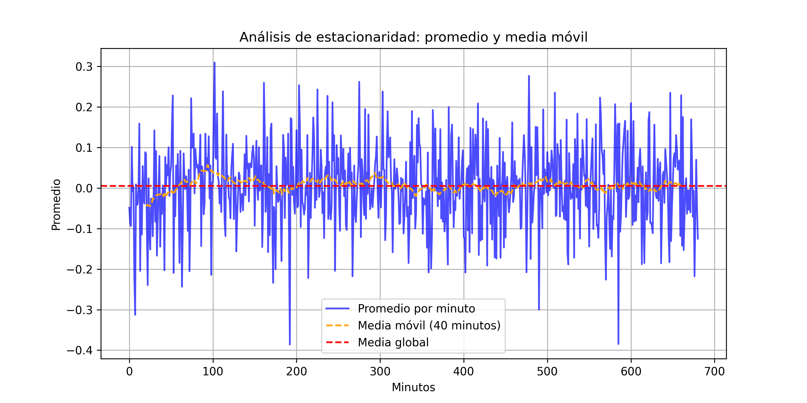
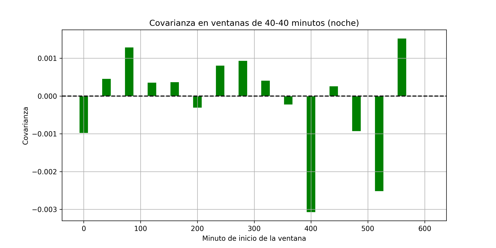
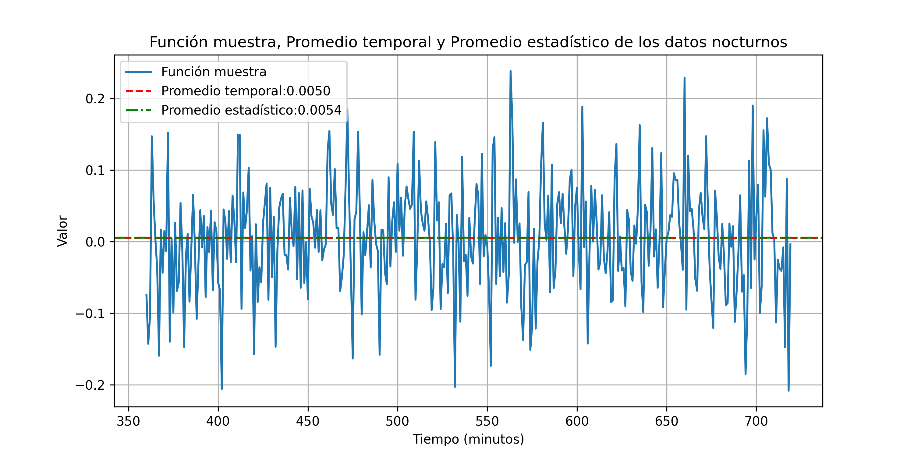

# Determinación de la Estacionaridad y Ergodicidad de los Datos Recolectados

En este análisis, se examinan los datos recolectados para determinar su estacionaridad en sentido amplio y su ergodicidad. Para ello, se utilizaron dos herramientas principales: el análisis del promedio a lo largo del tiempo y el estudio de la covarianza entre los puntos de la serie temporal.

## Estacionaridad en Sentido Amplio

La estacionaridad en sentido amplio de una serie temporal significa que las propiedades estadísticas de la serie (promedio, varianza y covarianza) no cambian con el tiempo. Específicamente, para determinar la estacionaridad en sentido amplio, se deben cumplir dos condiciones:

1. El promedio debe ser constante a lo largo de la serie temporal.
2. La covarianza entre varios puntos debe ser igual (o muy similar) a través del tiempo.

En primer lugar, se visualizó el promedio en función del tiempo para observar si este se mantenía constante.

### Análisis Visual del Promedio

Al examinar el gráfico, se observa que el promedio del conjunto total de muestras no es constante a lo largo del tiempo, especialmente en el rango de tiempo de 360 a 1079 minutos, que corresponde al periodo diurno. Durante este rango, el promedio presenta una variación significativa. Sin embargo, al considerar solo los rangos de 0 a 359 minutos y 1080 a 1400 minutos (noche), se observa que el promedio tiende a estabilizarse, lo que sugiere que durante la noche los datos pueden ser estacionarios.

### Análisis de Covarianza

Dado que el promedio no es constante en toda la serie, se analizó la covarianza entre los puntos de la serie temporal, particularmente en el intervalo nocturno (0-359 y 1080-1400 minutos), para evaluar si es estacionaria en sentido amplio.

Para facilitar la comparación de los datos y mejorar su interpretación, las muestras del intervalo nocturno se normalizaron para que todos los datos estuvieran en un rango similar, comenzando desde el minuto 0 y hasta el minuto 720. Esto permite observar los patrones sin la interferencia de los cambios de tiempo en el rango original, haciendo que los datos nocturnos sean más fáciles de visualizar y analizar de forma precisa.

Durante este análisis, se utilizó una media móvil de 40 minutos para suavizar las fluctuaciones a corto plazo y proporcionar una visión más clara de la tendencia general de los datos. La media móvil es una técnica estadística que calcula el promedio de los valores en una ventana de tiempo deslizante, lo que ayuda a identificar patrones y tendencias a lo largo del tiempo, minimizando el impacto de las variaciones aleatorias.

A continuación, también se calculó la media global de los datos nocturnos, que representa el promedio de todos los puntos dentro del intervalo de tiempo analizado, sin tener en cuenta las fluctuaciones a corto plazo. Esta media global sirve como referencia para comparar las variaciones en la serie temporal.

En el gráfico a continuación se muestra la media móvil de 40 minutos, junto con la media global para el intervalo nocturno:

Este gráfico ilustra cómo la media móvil ayuda a suavizar las fluctuaciones y cómo la media global representa el promedio general de las muestras durante el período nocturno.

#### Resultados Combinados de Correlación, Covarianza y Varianza por Ventanas de 40 Minutos (Noche)

A continuación, se presentan los resultados de correlación, covarianza y varianza calculados en ventanas de 40 minutos:

| Minuto de inicio | Correlación | Covarianza | Varianza |
|------------------|-------------|------------|----------|
| 0-40             | -0.0877     | -0.0010    | 0.0109   |
| 40-80            | 0.0362      | 0.0005     | 0.0123   |
| 80-120           | 0.1294      | 0.0013     | 0.0097   |
| 120-160          | 0.0759      | 0.0004     | 0.0049   |
| 160-200          | 0.0222      | 0.0004     | 0.0162   |
| 200-240          | -0.0288     | -0.0003    | 0.0107   |
| 240-280          | 0.0804      | 0.0008     | 0.0098   |
| 280-320          | 0.1202      | 0.0009     | 0.0076   |
| 320-360          | 0.0462      | 0.0004     | 0.0087   |
| 360-400          | -0.0242     | -0.0002    | 0.0097   |
| 400-440          | -0.2325     | -0.0031    | 0.0131   |
| 440-480          | 0.0287      | 0.0003     | 0.0092   |
| 480-520          | -0.1053     | -0.0009    | 0.0088   |
| 520-560          | -0.2614     | -0.0025    | 0.0095   |
| 560-600          | 0.0904      | 0.0015     | 0.0172   |
| 600-640          | -0.0005     | -0.0000    | 0.0087   |

### Relación entre Correlación, Covarianza y Varianza

Los resultados de la correlación, covarianza y varianza se presentan en conjunto para proporcionar una visión más completa del comportamiento de la serie temporal. La correlación mide la relación lineal entre los puntos de la serie en las distintas ventanas, mientras que la covarianza describe cómo varían conjuntamente dos variables, y la varianza indica cuánto se dispersan los datos en cada ventana. 

- **Correlación**: En las ventanas de tiempo, se observa que la correlación varía entre valores negativos y positivos, lo que indica que las relaciones entre los puntos de la serie no son completamente constantes a lo largo del tiempo. Sin embargo, la falta de cambios abruptos en la correlación dentro del intervalo nocturno (0-359 y 1080-1400 minutos) sugiere una estabilidad relativa en ese periodo.
  
- **Covarianza**: Similar a la correlación, la covarianza también muestra variaciones pequeñas y estables durante la noche, lo que indica que las fluctuaciones entre los puntos de la serie son relativamente constantes, sin mostrar grandes tendencias o desviaciones.
  
- **Varianza**: La varianza muestra los niveles de dispersión de los datos dentro de cada ventana de 40 minutos. Aunque hay algunas variaciones, especialmente en las primeras ventanas, la varianza permanece dentro de un rango relativamente estable en la noche.

Para una representación visual de estos resultados, se pueden consultar los gráficos de correlación, covarianza y varianza obtenidos:

- Correlación: 
- Covarianza: 
- Varianza: 

## Ergodicidad

La ergodicidad se refiere a si las estadísticas de la serie temporal, como la media y la varianza, calculadas a partir de una única realización, son representativas de las estadísticas del proceso en su totalidad. En otras palabras, un proceso es ergódico si el promedio de las muestras tomadas en un intervalo de tiempo largo es igual al promedio estadístico global de todo el proceso.

### Estacionaridad y Ergodicidad

Para que un proceso sea ergódico, primero debe ser estacionario en sentido amplio, ya que las propiedades estadísticas (como la media y la varianza) deben ser constantes a lo largo del tiempo. Como se mencionó anteriormente, durante el intervalo nocturno (de 0 a 359 minutos y de 1080 a 1400 minutos), la serie temporal cumple con las condiciones de estacionaridad en sentido amplio, lo que sugiere que los datos pueden ser ergódicos en este periodo.

Sin embargo, durante el intervalo diurno (de 360 a 1079 minutos), no se cumplen las condiciones de estacionaridad en sentido amplio, por lo que los datos no pueden considerarse ergódicos durante este período.

### Promedio Temporal y Promedio Estadístico

Para verificar la ergodicidad en el intervalo nocturno, se comparó el promedio temporal de la muestra (obtenido a partir de las observaciones durante la noche) con el promedio estadístico global. Si ambos promedios son similares, se puede concluir que los datos son ergódicos.

Se utilizó una función muestra para calcular los valores de la muestra a lo largo del tiempo y graficarlos. El gráfico resultante se muestra a continuación:

Los resultados obtenidos son los siguientes:

- **Promedio estadístico (global)**: 0.0054
- **Promedio temporal de la muestra**: 0.0050

Dado que el promedio temporal de la muestra es muy cercano al promedio estadístico global, podemos concluir que **los datos son ergódicos** en el intervalo nocturno.

## Conclusión de la Estacionaridad y Ergodicidad

Con base a los resultados obtenidos de correlación, covarianza y varianza en ventanas de 40 minutos, se concluye lo siguiente:

### Estacionaridad

Durante el intervalo nocturno (de 0 a 359 minutos y de 1080 a 1400 minutos), la serie temporal muestra características claras de estacionaridad en sentido amplio. Las propiedades estadísticas como el promedio, la varianza y la covarianza se mantienen constantes a lo largo del tiempo, sin fluctuaciones significativas. Esto se observa en la correlación y la covarianza, que no presentan cambios drásticos, sugiriendo que durante la noche la serie temporal cumple con las condiciones de estacionaridad en sentido amplio.

Sin embargo, durante el intervalo diurno (de 360 a 1079 minutos), aunque las fluctuaciones siguen una distribución normal, no se cumple con la estacionaridad en sentido amplio. A pesar de la forma normal de las fluctuaciones, las propiedades estadísticas como el promedio y la covarianza no permanecen constantes, lo que impide que se considere estacionaria en sentido amplio en este periodo. Las variaciones diurnas son predecibles de manera estocástica, pero la falta de constancia en la varianza y la covarianza impide que se considere estacionaria en sentido amplio.

### Ergodicidad

Para que los datos sean ergódicos, deben ser primero estacionarios en sentido amplio. En este sentido, durante el intervalo nocturno, los datos cumplen con la estacionaridad en sentido amplio, lo que permite que se cumpla la ergodicidad. Al comparar el promedio temporal con el promedio estadístico, se observa una alta coincidencia, lo que confirma que los datos son ergódicos durante la noche.

Por el contrario, en el intervalo diurno, los datos no son ergódicos debido a la falta de estacionaridad en sentido amplio, lo que impide que las estadísticas calculadas a partir de una única realización sean representativas del proceso completo.

### Conclusión Final

- **Estacionaridad**: La serie temporal es estacionaria en sentido amplio solo durante el intervalo nocturno. En el periodo diurno, aunque las fluctuaciones siguen una distribución normal, no se cumplen las condiciones de estacionaridad en sentido amplio.
- **Ergodicidad**: Los datos son ergódicos durante el intervalo nocturno, ya que cumplen con la estacionaridad en sentido amplio. Durante el intervalo diurno, no son ergódicos debido a la falta de estacionaridad en sentido amplio.

En resumen, la estacionaridad en sentido amplio y la ergodicidad se cumplen solo durante el periodo nocturno, mientras que en el periodo diurno no se cumplen debido a las fluctuaciones no estacionarias, a pesar de que las fluctuaciones siguen una distribución normal.
