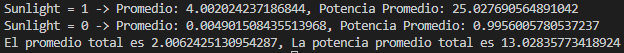

# Potencia Promedio
La potencia promedio de un proceso estocástico 𝑋(𝑡) es una medida del promedio de la potencia instantánea del proceso a lo largo del tiempo. Describe el nivel de energía promedio por unidad de tiempo asociado con el proceso. Este concepto es fundamental en el análisis de señales aleatorias, especialmente cuando se desea evaluar la intensidad de una señal en el tiempo.
 Se define como:

$$ P_{XX} = \lim_{T \to \infty} \frac{1}{2T} \int_{-T}^{T} E[X^2(t)] \,dt $$

Donde  $E[X^2(t)]$  Representa el valor esperado del cuadrado del proceso 𝑋(t) en un instante t. Para una señal determinista, $X^2(t)$ sería simplemente la potencia instantánea en 𝑡. Sin embargo, en el caso de procesos aleatorios, se toma el promedio estadístico debido a la variabilidad inherente del proceso. 

Para calcularlo con los valores obtenidos en la recoleccion de datos se utiliza la siguiente deduccion:

$$ P_{XX} = \lim_{T \to \infty} \frac{1}{2T} \int_{-T}^{T} E[X^2(t)] \,dt = A\{E[X^2(t)]\} $$

Por lo cual la potencia es el promedio temporal de su segundo momento ordinario, en este caso se sacó la potencia promedio en la cuando no hay luz de sol indicado por `sunlight = 0`, cuando hay luz solar indicado por `sulight = 1` y en total de todo el dia dando el siguiente resultado:

Se observa que a como es esperado, la mayor potencia se da cuando `sunlight = 1` ya que es cuando se empieza a tener mayores valores mientras que cuando `sunlight = 0` se tiene que los promedios de cada instante de tiempo rondan a cero, por lo cual se produce esa significativa diferencias de potencia cuando hay luz solar.