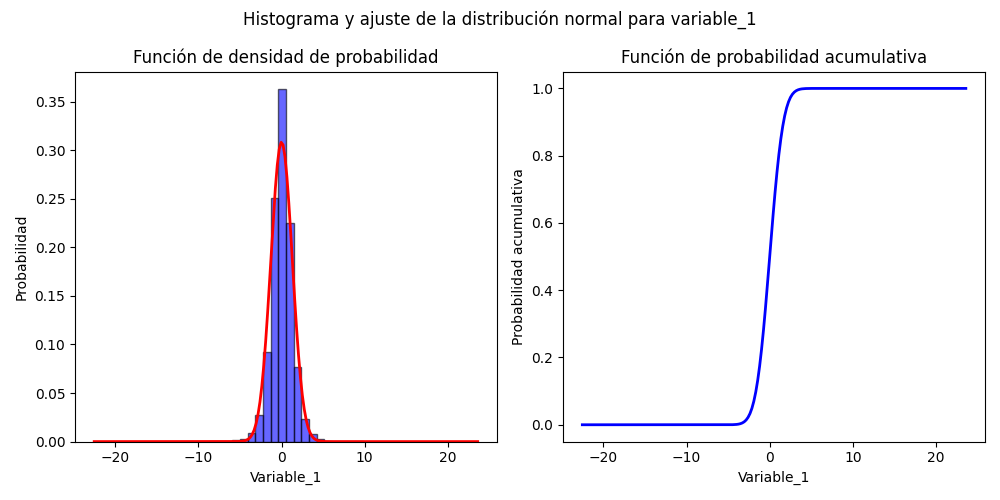
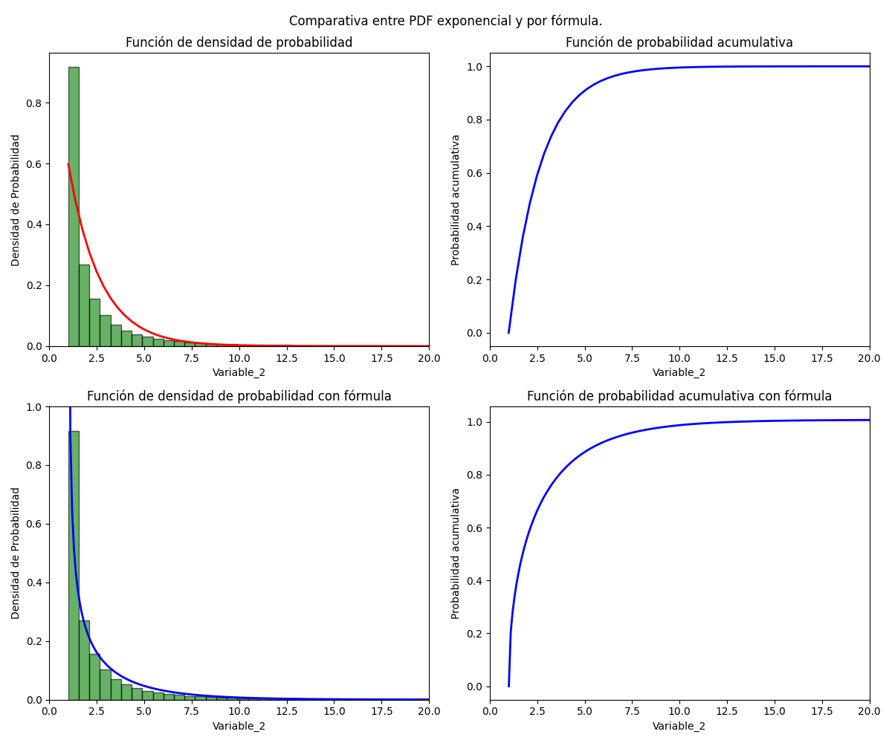

# Avance del Proyecto
A continuación se va a presentar lo que se realizó para el avance del protecto de Modelos Probabilisticos de señales y sistemas.
## Cambios en el modelo de base de datos y tareas de recoleccion de datos
En los dados de `models.py` y `task.py` se realizan cambios menores para la creacion de base de datos en el archivo `models.py` ya que en los datos que se van a recibir `kalouk.xyz` por medio de la API, son dos variables de tipo float, y el modelo esta hecho para tres variables, de la misma forma se adaptó la tarea de recoleccion de datos en el archivo `task.py` para que esté construidos para dos variables.
## Recolección de datos  

Para la recolección de datos se estuvo realizando una solicitud a la API para obtener los datos de la pagina web, en un periodo de 15 segundos, en el cual se va a estar recibiendo 100 datos en ese perido, para esto se utilizó el administrador de tareas `Celery Worker` en conjunto con el planificador de tareas `Celery Beat` con el intermediador de `redis` para que se pueda recolectar 12 horas continuas los datos del sitio web, al final, se dejó un poco mas de tiempo recolectando datos,alrededor de 14 horas , por lo cual se recopilaron cerca de 330 000 datos.

## Análisis exploratorio de los datos

Se recopilaron dos conjuntos de datos `variable_1` y `variable_2`, con distribuciones desconocidas y con una transformación indicada como: `variable_2` = (`variable_1`)^2 + 1.

###  Gráficas descriptivas de `variable_1` y `variable_2`

Para obtener todas las gráficas y resultados presentados en adelante se puede correr el archivo en `src/main.py` desde el directorio principal del repositorio. Para obtener una presentación visual de la manera que estan distribuidos los datos se crearon los histogramas de las variables.

##### Variable_1

##### Variable_2

Se aprecia que en `variable_1` posee una distribucion normal o gaussiana, ya que se aprecia la famosa forma de campana y es simetrica, mientras que `variable_2` tiene una distribución aparentemente exponencial debido a que se pasa tener una densidad grande a una pequeña de una forma muy rapida.

### Modelos de probabilidad para los datos

Se obtuvieron los modelos de ambas variables, para esto se calculan la función de densidad de probabilidad (PDF) y la función de probabilidad acumulativa (CDF) de ambas.

##### Variable_1

##### Variable_2

Las PDF y CDF del modelo para la `variable_1` y el primer set de la `variable_2` se calcularon por medio de módulos de python con la librería `scipy.stats`. Se calcularon según los modelos identificados en la sección anterior (normal y exponencial). Para la `variable_1` se nota que el modelo se ajusta relativamente bien en forma, pues la curva sigue el comportamiento del histograma y se muestra como el CDF aumenta drásticamente cerca de los puntos más probables y se estabiliza en 1. Para la `variable_2` se empleó primeramente el modelo exponencial, generando las figuras superiores que presentan un ajuste ligeramente más lento en decrecimiento al del histograma pero cumplen en la mayoría de aspectos. Por otro lado, se muestra otra curva para la misma variable, la cual se obtiene de calcular la PDF de la `variable_2` por medio de la transformación citada y asumiendo que la `variable_1` proviene de una distribución normal. Se nota que esta tiene un mejor ajuste a la exponencial, por lo que es mas cercana al ajuste real, solo posee el problema que se indefine en 1 causando que la densidad de probabilidad crezca indefinidamente. Aún así, su integral converge a 1, para más información en como se obtuvo la fórmula y su comprobación visitar [anexo](#anexos).

### Momentos Estadísticos

Los momentos estadísticos son medidas que describen diferentes aspectos de la distribución de un conjunto de datos. A continuación, se presentan los momentos calculados para las variables `variable_1` y `variable_2`.

1. **Media**: La media es el promedio aritmético de los datos, que indica la tendencia central.
2. **Varianza**: La varianza mide la dispersión de los datos respecto a la media. Se calcula como el promedio de las diferencias al cuadrado entre cada dato y la media.
3. **Desviación Estándar**: La desviación estándar es la raíz cuadrada de la varianza, ofreciendo una medida de la dispersión en las mismas unidades que los datos.
4. **Asimetría (Skewness)**: La asimetría mide la simetría de la distribución. Un valor positivo indica que la cola derecha es más larga, mientras que un valor negativo indica una cola izquierda más larga.
5. **Curtosis**: La curtosis mide la "altura" y "ancho" de la distribución. La función `scipy.stats.kurtosis()` calcula el exceso de curtosis, que es la diferencia entre la curtosis de los datos y 3 (la kurtosis de una distribución normal). Se clasifica de la siguiente manera:
    * **Leptocúrtica**: Exceso de curtosis mayor que 0 (curtosis > 3), indicando colas más pesadas y un pico más alto en comparación con la normal, lo que sugiere más valores extremos.
    * **Mesocúrtica**: Exceso de curtosis igual a 0 (curtosis = 3), lo que sugiere que la distribución tiene colas y un pico similares a una distribución normal.
    * **Platicúrtica**: Exceso de curtosis menor que 0 (curtosis < 3), indicando colas más ligeras y un pico más plano, lo que sugiere menos valores extremos.
    * **Nota**: En el contexto del cálculo de momentos estadísticos, se toma como referencia el valor cero porque se utiliza la librería **SciPy**, que considera la curtosis de una distribución normal como igual a cero. Esto implica que una distribución con un exceso de curtosis positivo indica colas más pesadas que la normal, mientras que un exceso negativo indica colas más ligeras.

#### Momentos de `variable_1`

1. **Media**: 
    * **Valor**: -0.00034
    * **Interpretación**: La media muy cercana a cero sugiere que los datos están distribuidos alrededor del origen, lo que indica que no hay una tendencia significativa en ninguna dirección.

2. **Varianza**: 
    * **Valor**: 1.6720
    * **Interpretación**: Una varianza relativamente alta indica que los datos están bastante dispersos alrededor de la media. Esto sugiere que hay una considerable variabilidad en los datos.

3. **Desviación Estándar**: 
    * **Valor**: 1.2931
    * **Interpretación**: La desviación estándar es una medida de dispersión que indica que, en promedio, los datos se desvían en aproximadamente 1.29 unidades de la media.

4. **Asimetría (Skewness)**: 
    * **Valor**: -0.0084
    * **Interpretación**: Un valor de asimetría cercano a cero sugiere que la distribución es aproximadamente simétrica, con colas de igual longitud a ambos lados de la media.

5. **Curtosis**: 
    * **Valor**: 4.6998
    * **Interpretación**: Un valor de curtosis mayor que 0 (por usar la función) indica que la distribución es leptocúrtica, con colas más pesadas y un pico más alto que una distribución normal. Esto puede implicar que hay más datos extremos (outliers).

Los siguientes gráficos ilustran la distribución de `variable_1`, con líneas que indican la media, las desviaciones estándar, y los momentos estadísticos calculados.

##### Gráficos de `variable_1`

 * **Histograma de variable_1**:
  

 * **Ajuste de la distribución normal a variable_1**:
  

#### Momentos de `variable_2`

1. **Media**: 
    * **Valor**: 2.6720
    * **Interpretación**: La media sugiere que los datos están distribuidos en torno a un valor positivo, lo que podría indicar un sesgo hacia valores más altos.

2. **Varianza**: 
    * **Valor**: 2.7955
    * **Interpretación**: Una varianza más alta en comparación con `variable_1` sugiere una mayor dispersión en los datos.

3. **Desviación Estándar**: 
    * **Valor**: 1.6719
    * **Interpretación**: Esto indica que los datos se desvían en promedio aproximadamente 1.67 unidades de la media.

4. **Asimetría (Skewness)**: 
    * **Valor**: 2.0
    * **Interpretación**: Un valor de asimetría positivo indica que la distribución tiene una cola derecha más larga, sugiriendo que hay más valores extremos en la parte alta de la distribución.

5. **Curtosis**: 
    * **Valor**: 6.0
    * **Interpretación**: Este valor alto sugiere que la distribución es leptocúrtica, con colas aún más pesadas que las de `variable_1`, lo que podría indicar la presencia de muchos outliers.

Los siguientes gráficos muestran la distribución de `variable_2`, con líneas que indican la media, las desviaciones estándar, y los momentos estadísticos calculados.

### Gráficos de `variable_2`

  **Histograma de variable_2**:
  

  **Ajuste de la distribución exponencial a variable_2**:
  

## Anexos

#### Obtención de fórmula de PDF para `variable_2`

Considerando que $X_2 = T(X_1) = X_1^2 + 1$ (no monotónica) y la PDF de una distribución normal normal es:

$$ f_{X_1} (x_1) = \frac{1}{\sqrt{2\pi \sigma^2}} e^{-\frac{(x_1 - \mu)^2}{2\sigma^2}},\quad -\infty < x_1 < \infty$$

Se aplica la fórmula para la función de densidad de probabilidad de una variable transformada con una transformación no monotónica continua: 

$$f_Y(y)=\sum_n \frac{f_X\left(x_n\right)}{\left.\left|\frac{\mathrm{d}}{\mathrm{d} x} T(x)\right|_{x=x_n} \right\rvert\,}$$

Se tienen las raíces de la transformación: $x_n = \{ \sqrt{x_2-1}, - \sqrt{x_2-1}\}$

Y la derivada de la transformación: $\frac{\mathrm{d}}{\mathrm{d} x} T(x) = 2x \Rightarrow \left.\left|\frac{\mathrm{d}}{\mathrm{d} x} T(x)\right|_{x=x_n} \right\rvert\, = 2\sqrt{x_2-1}$

Evaluando las raíces en la ecuación, se tiene que:

$$f_{X_2}(x_2)=\frac{1}{\sqrt{2\pi \sigma^2}} \cdot \frac{e^{-\frac{(\sqrt{x_2-1} - \mu)^2}{2\sigma^2}} + e^{-\frac{(-\sqrt{x_2-1} - \mu)^2}{2\sigma^2}}}{2\sqrt{x_2-1}},\quad 1 < x_2 < \infty$$

Se evalúan la desviación y media obtenidas del ajuste normal realizado en la `variable_1`. Se puede comprobar la forma de la PDF al igual que la convergencia de la CDF al mostrar ambas curvas en geogebra, se tiene la memoria de la simulación en un [archivo geogebra](misc/geogebra-export.ggb) el cual se puede abrir en la [calculadora geogebra](https://www.geogebra.org/calculator) para utilizar la simulación.

