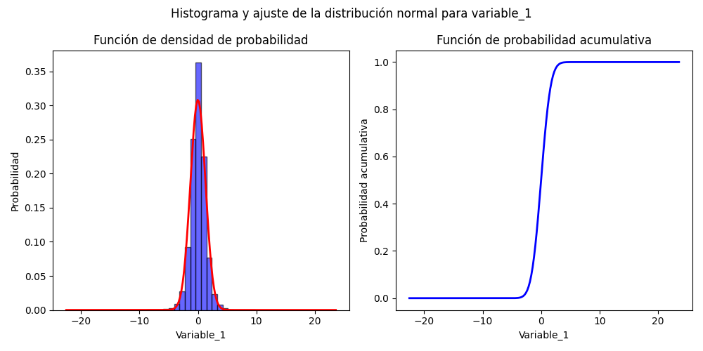
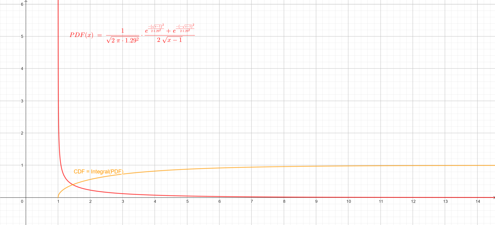

# Avance del Proyecto: Obtención de datos y modelos

## Cambios en el modelo de base de datos y tareas de recoleccion de datos
En los dados de `models.py` y `task.py` se realizan cambios menores para la creacion de base de datos en el archivo `models.py` ya que en los datos que se van a recibir `kalouk.xyz` por medio de la API, son dos variables de tipo float, y el modelo esta hecho para tres variables, de la misma forma se adaptó la tarea de recoleccion de datos en el archivo `task.py` para que esté construidos para dos variables.
## Recolección de datos  

Para la recolección de datos se estuvo realizando una solicitud a la API para obtener los datos de la pagina web, en un periodo de 15 segundos, en el cual se va a estar recibiendo 100 datos en ese perido, para esto se utilizó el administrador de tareas `Celery Worker` en conjunto con el planificador de tareas `Celery Beat` con el intermediador de `redis` para que se pueda recolectar 12 horas continuas los datos del sitio web, al final, se dejó un poco mas de tiempo recolectando datos,alrededor de 14 horas , por lo cual se recopilaron cerca de 330 000 datos.

## Análisis exploratorio de los datos

Se recopilaron dos conjuntos de datos `variable_1` y `variable_2`, con distribuciones desconocidas y con una transformación indicada como: `variable_2` = (`variable_1`)^2 + 1.

###  Gráficas descriptivas de `variable_1` y `variable_2`

Para obtener todas las gráficas y resultados presentados en adelante se puede correr el archivo en `src/main.py` desde el directorio principal del repositorio. Para obtener una presentación visual de la manera que estan distribuidos los datos se crearon los histogramas de las variables.

##### Variable_1

##### Variable_2

Se aprecia que en `variable_1` posee una distribucion normal o gaussiana, ya que se aprecia la famosa forma de campana y es simetrica, mientras que `variable_2` tiene una distribución aparentemente exponencial debido a que se pasa tener una densidad grande a una pequeña de una forma muy rapida.

### Modelos de probabilidad para los datos

Se obtuvieron los modelos de ambas variables, para esto se calculan la función de densidad de probabilidad (PDF) y la función de probabilidad acumulativa (CDF) de ambas.

##### Variable_1

##### Variable_2

Las PDF y CDF del modelo para la `variable_1` y el primer set de la `variable_2` se calcularon por medio de módulos de python con la librería `scipy.stats`. Se calcularon según los modelos identificados en la sección anterior (normal y exponencial). Para la `variable_1` se nota que el modelo se ajusta relativamente bien en forma, pues la curva sigue el comportamiento del histograma y se muestra como el CDF aumenta drásticamente cerca de los puntos más probables y se estabiliza en 1. Para la `variable_2` se empleó primeramente el modelo exponencial, generando las figuras superiores que presentan un ajuste ligeramente más lento en decrecimiento al del histograma pero cumplen en la mayoría de aspectos. Por otro lado, se muestra otra curva para la misma variable, la cual se obtiene de calcular la PDF de la `variable_2` por medio de la transformación citada y asumiendo que la `variable_1` proviene de una distribución normal. Se nota que esta tiene un mejor ajuste a la exponencial, por lo que es mas cercana al ajuste real, solo posee el problema que se indefine en 1 causando que la densidad de probabilidad crezca indefinidamente. Aún así, su integral converge a 1.

#### Obtención de fórmula de PDF para `variable_2`

Considerando que $X_2 = T(X_1) = X_1^2 + 1$ (no monotónica) y la PDF de una distribución normal normal es:

$$ f_{X_1} (x_1) = \frac{1}{\sqrt{2\pi \sigma^2}} e^{-\frac{(x_1 - \mu)^2}{2\sigma^2}},\quad -\infty < x_1 < \infty$$

Se aplica la fórmula para la función de densidad de probabilidad de una variable transformada con una transformación no monotónica continua: 

$$f_Y(y)=\sum_n \frac{f_X\left(x_n\right)}{\left.\left|\frac{\mathrm{d}}{\mathrm{d} x} T(x)\right|_{x=x_n} \right\rvert\,}$$

Se tienen las raíces de la transformación: $x_n = \{ \sqrt{x_2-1}, - \sqrt{x_2-1}\}$

Y la derivada de la transformación: $\frac{\mathrm{d}}{\mathrm{d} x} T(x) = 2x \Rightarrow \left.\left|\frac{\mathrm{d}}{\mathrm{d} x} T(x)\right|_{x=x_n} \right\rvert\, = 2\sqrt{x_2-1}$

Evaluando las raíces en la ecuación, se tiene que:

$$f_{X_2}(x_2)=\frac{1}{\sqrt{2\pi \sigma^2}} \cdot \frac{e^{-\frac{(\sqrt{x_2-1} - \mu)^2}{2\sigma^2}} + e^{-\frac{(-\sqrt{x_2-1} - \mu)^2}{2\sigma^2}}}{2\sqrt{x_2-1}},\quad 1 < x_2 < \infty$$

Se evalúan la desviación y media obtenidas del ajuste normal realizado en la `variable_1`. Se puede comprobar la forma de la PDF al igual que la convergencia de la CDF al mostrar ambas curvas en geogebra, se tiene la memoria de la simulación en un [archivo geogebra](misc/geogebra-export.ggb) el cual se puede abrir en la [calculadora geogebra](https://www.geogebra.org/calculator) para utilizar la simulación.

