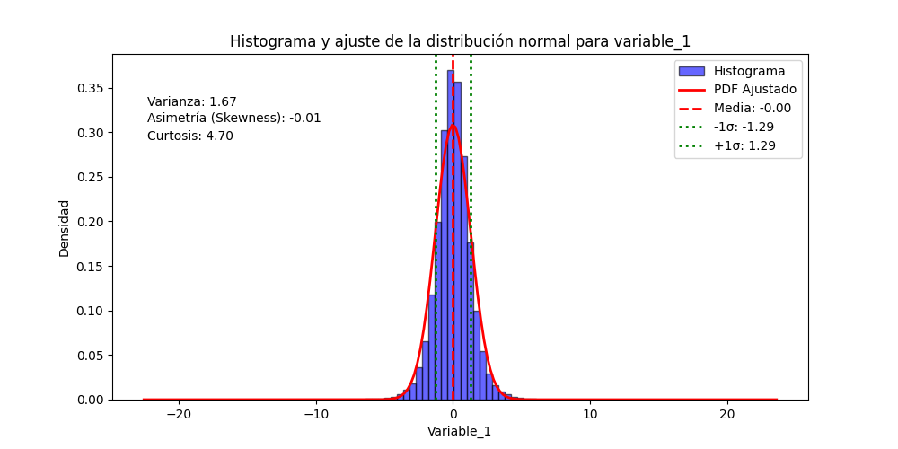
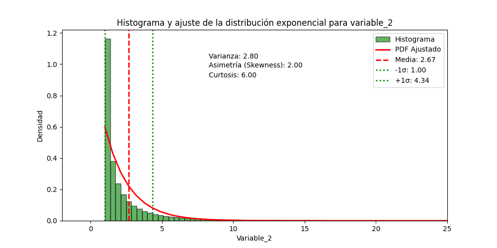

# Avance del Proyecto: Análisis de momentos estadísticos

## Momentos Estadísticos

Los momentos estadísticos son medidas que describen diferentes aspectos de la distribución de un conjunto de datos. A continuación, se presentan los momentos calculados para las variables `variable_1` y `variable_2`.

1. **Media**: La media es el promedio aritmético de los datos, que indica la tendencia central.
2. **Varianza**: La varianza mide la dispersión de los datos respecto a la media. Se calcula como el promedio de las diferencias al cuadrado entre cada dato y la media.
3. **Desviación Estándar**: La desviación estándar es la raíz cuadrada de la varianza, ofreciendo una medida de la dispersión en las mismas unidades que los datos.
4. **Asimetría (Skewness)**: La asimetría mide la simetría de la distribución. Un valor positivo indica que la cola derecha es más larga, mientras que un valor negativo indica una cola izquierda más larga.
5. **Curtosis**: La curtosis mide la "altura" y "ancho" de la distribución. La función `scipy.stats.kurtosis()` calcula el exceso de curtosis, que es la diferencia entre la curtosis de los datos y 3 (la kurtosis de una distribución normal). Se clasifica de la siguiente manera:
    * **Leptocúrtica**: Exceso de curtosis mayor que 0 (curtosis > 3), indicando colas más pesadas y un pico más alto en comparación con la normal, lo que sugiere más valores extremos.
    * **Mesocúrtica**: Exceso de curtosis igual a 0 (curtosis = 3), lo que sugiere que la distribución tiene colas y un pico similares a una distribución normal.
    * **Platicúrtica**: Exceso de curtosis menor que 0 (curtosis < 3), indicando colas más ligeras y un pico más plano, lo que sugiere menos valores extremos.
    * **Nota**: En el contexto del cálculo de momentos estadísticos, se toma como referencia el valor cero porque se utiliza la librería **SciPy**, que considera la curtosis de una distribución normal como igual a cero. Esto implica que una distribución con un exceso de curtosis positivo indica colas más pesadas que la normal, mientras que un exceso negativo indica colas más ligeras.

#### Momentos de `variable_1`

1. **Media**: 
    * **Valor**: -0.00034
    * **Interpretación**: La media muy cercana a cero sugiere que los datos están distribuidos alrededor del origen, lo que indica que no hay una tendencia significativa en ninguna dirección.

2. **Varianza**: 
    * **Valor**: 1.6720
    * **Interpretación**: Una varianza relativamente alta indica que los datos están bastante dispersos alrededor de la media. Esto sugiere que hay una considerable variabilidad en los datos.

3. **Desviación Estándar**: 
    * **Valor**: 1.2931
    * **Interpretación**: La desviación estándar es una medida de dispersión que indica que, en promedio, los datos se desvían en aproximadamente 1.29 unidades de la media.

4. **Asimetría (Skewness)**: 
    * **Valor**: -0.0084
    * **Interpretación**: Un valor de asimetría cercano a cero sugiere que la distribución es aproximadamente simétrica, con colas de igual longitud a ambos lados de la media.

5. **Curtosis**: 
    * **Valor**: 4.6998
    * **Interpretación**: Un valor de curtosis mayor que 0 (por usar la función) indica que la distribución es leptocúrtica, con colas más pesadas y un pico más alto que una distribución normal. Esto puede implicar que hay más datos extremos (outliers).

Los siguientes gráficos ilustran la distribución de `variable_1`, con líneas que indican la media, las desviaciones estándar, y los momentos estadísticos calculados.

##### Gráficos de `variable_1`

 * **Histograma de variable_1**:
  

 * **Ajuste de la distribución normal a variable_1**:
  

#### Momentos de `variable_2`

1. **Media**: 
    * **Valor**: 2.6720
    * **Interpretación**: La media sugiere que los datos están distribuidos en torno a un valor positivo, lo que podría indicar un sesgo hacia valores más altos.

2. **Varianza**: 
    * **Valor**: 2.7955
    * **Interpretación**: Una varianza más alta en comparación con `variable_1` sugiere una mayor dispersión en los datos.

3. **Desviación Estándar**: 
    * **Valor**: 1.6719
    * **Interpretación**: Esto indica que los datos se desvían en promedio aproximadamente 1.67 unidades de la media.

4. **Asimetría (Skewness)**: 
    * **Valor**: 2.0
    * **Interpretación**: Un valor de asimetría positivo indica que la distribución tiene una cola derecha más larga, sugiriendo que hay más valores extremos en la parte alta de la distribución.

5. **Curtosis**: 
    * **Valor**: 6.0
    * **Interpretación**: Este valor alto sugiere que la distribución es leptocúrtica, con colas aún más pesadas que las de `variable_1`, lo que podría indicar la presencia de muchos outliers.

Los siguientes gráficos muestran la distribución de `variable_2`, con líneas que indican la media, las desviaciones estándar, y los momentos estadísticos calculados.

### Gráficos de `variable_2`

  **Histograma de variable_2**:
  

  **Ajuste de la distribución exponencial a variable_2**:
  