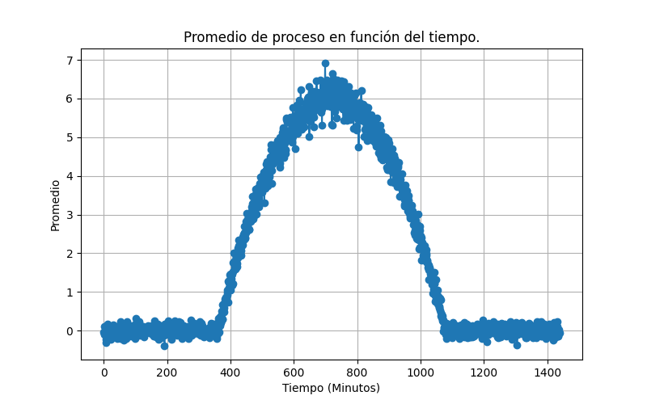
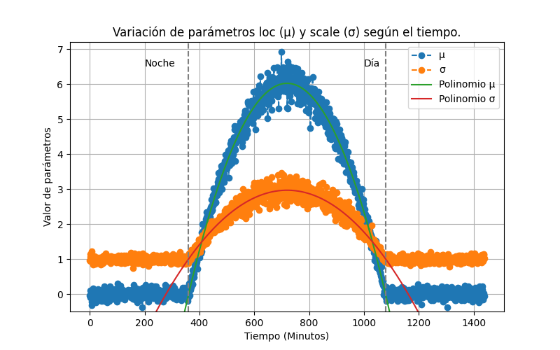
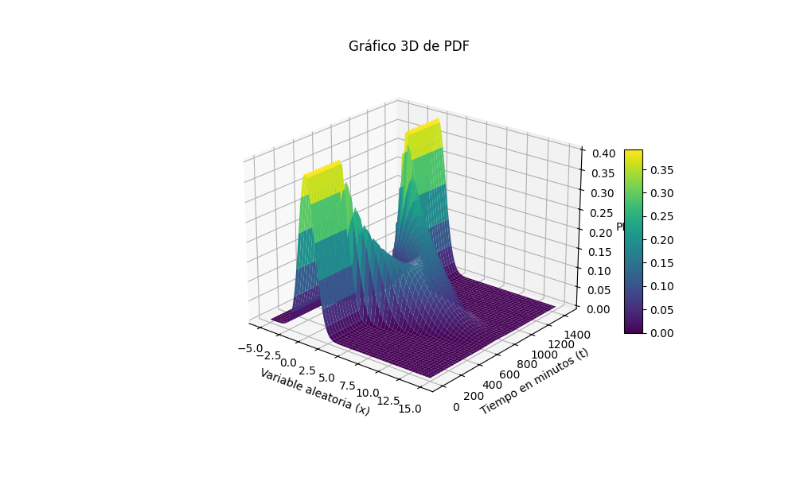

# Reporte final: Obtención de función de densidad de probabilidad

A partir de la recolección de datos realizada durante 24 horas, se puede determinar la función de densidad del proceso aleatorio al primero identificar la distribución de los datos, y luego obtener una función en el tiempo de sus parámetros. Según se indicó, la distribución del proceso no cambia con el tiempo (como es usual en procesos típicos), solo sus parámetros. Una vez se obtenga la función de densidad del proceso, se puede estudiar más profundamente.

## Promedio temporal

Primeramente, se generó un gráfico de la variación del promedio de los datos en el tiempo. Para esto se obtuvo el promedio de los 100 datos obtenidos en cada instante de tiempo (cada minuto) y se graficó en función del minuto en que se tomaron los datos (con el minuto concordando con el timestamp registrado). Al realizar este proceso, se obtuvo la siguiente figura, donde se nota que el comportamiento de los datos cambia drásticamente a distintas horas del día. Más adelante se demuestra que esta diferencia se da entre los minutos donde el parámetro "sunlight" está activado o no.

## Identificación de distribución

Para identificar el tipo de distribución que mejor describe a los datos en su totalidad, se emplea la función `get.best()` del paquete `Fitter`, la cual ajusta los datos a un conjunto de distribuciones distintas y determina cual posee el menor error (y por ende es la mejor). Para realizar correctamente esta prueba se debe aplicar a los datos obtenidos en un mismo instante de tiempo, es decir se hace el ajuste para los 100 datos de un mismo timestamp. Para ser robustos y asegurarse que la distribución empleada es la más representativa del proceso, se utilizó la función `obtenerMejorFit` (elaborada en el archivo `finalPDF.py`) que obtiene el mejor ajuste de cada instante de tiempo disponible y los cuenta según mayor frecuencia.  **Nota: Para correr esta función se debe correr src/finalPDF.py directamente, pero es bastante extensa, para verificar los datos se recomienda ver el archivo de memoria de dicha función [resultadosPruebasFitting](misc/resultadosPruebasFitting.txt)**

Ajustando con las 6 distribuciones indicadas para este proyecto: exponencial, gompertz, levy, logistic, normal y rayleigh. Se obtuvieron los siguientes resultados:

| Distribución | Contador general | Contador de día | Contador de noche |
|:------------:|:----------------:|:---------------:|:-----------------:|
|    Normal    |        721       |       360       |        361        |
|   Logistic   |        497       |       255       |        242        |
|   Gompertz   |        184       |        88       |         96        |
|   Rayleigh   |        36        |        17       |         19        |
|     Levy     |         0        |        0        |         0         |
|  Exponencial |         0        |        0        |         0         |

De esta prueba se puede identificar que la distribución normal fue la más concurrente, sin presentar diferencias evidentes entre su frecuencia durante el día o la noche. Esto indica que las diferencias de tiempo no afectaron esta medida, y que en la grán mayoría de casos se dieron distribuciones normales o logistic. La diferencia entre la frecuencia de distribución normal y de logistic no es muy elevada, pero aún así se asume que la distribución es normal porque se da una diferencia de 224 casos entre estas. Por esto, se concluye que la distribución del proceso aleatorio es **normal**.

## Funciones temporales de parámetros de distribución

Una vez se identificó que la distribución estadística del proceso es normal, se debe pasar a identificar una función del tiempo para sus dos parámetros variantes, siendo la media ($\mu$) y la desviación estándar ($\sigma$). Estas se pueden obtener para un mismo instante de tiempo al usar la función `norm.fit` de scipy.stats, y se aplica este método para cada instante de tiempo disponible. Los resultados de estos ajustes se muestran en la siguiente figura:

En la figura se marcan los límites entre día y noche a partir de las líneas grises punteadas, donde el intervalo de tiempo entre el minuto 360 y el minuto 1079 corresponde al intervalo con sunlight puesto en `True`. Se puede nuevamente notar el comportamiento muy distinto entre los parámetros según si se encuentran en este intervalo o no, y al ser tan diferentes se procede a analizar de forma separada. Para las secciones de noche se nota que los valores se mantienen relativamente constantes en los valores de 1 y 0 para $\sigma$ y $\mu$ respectivamente, por lo que se pueden describir como constantes en este intervalo. Por otro lado, en el intervalo de día se muestra una variación de forma parabólica en ambas, por lo que se realizan ajustes polinómicos de grado 2 en ambas. Al realizar los ajustes se obtienen las siguientes funciones:

$$
\begin{cases}
    \mu(t) = -4.671218 \cdot 10^{-5}t^2 + 0.067239t - 18.176150\\
    \sigma(t) = -1.520736 \cdot 10^{-5}t^2 +  0.021894t - 4.915082
\end{cases}
$$

Estos ajustes se graficaron en la figura mostrada anteriormente, donde se puede notar que se acoplan correctamente a los datos, indicando que son válidos. Se puede conseguir la función de densidad para día de esta forma:

$$
f(x_{\text{día}},t)= \frac{1}{\sqrt{2\pi (-1.520736 \cdot 10^{-5}t^2 +  0.021894t - 4.915082)^2}} e^{-\frac{(x - -4.671218 \cdot 10^{-5}t^2 + 0.067239t - 18.176150)^2}{2(-1.520736 \cdot 10^{-5}t^2 +  0.021894t - 4.915082)^2}}
$$

## Función de densidad de probabilidad

Con esta información, se puede armar la forma general de la función de densidad de probabilidad para este proceso aleatorio, de la siguiente forma, donde x representa la variable aleatoria y t es el tiempo en **minutos** con dominio 0 < t < 1440 mins:

$$
f(x,t) = 
\begin{cases}
\frac{1}{\sqrt{2\pi \sigma(t)^2}} e^{-\frac{(x - \mu(t))^2}{2\sigma(t)^2}},\quad 360 < t < 1079 \text{ mins} \\
\frac{1}{\sqrt{2\pi}} e^{-\frac{x^2}{2}},\quad \text{en otro caso}
\end{cases}
,\quad -\infty < x < \infty
$$

Se puede visualizar esta PDF en el siguiente gráfico 3D, evaluado en todo el dominio de tiempo establecido y en un rango reducido de x (donde se aprecia la mayoría de la amplitud no 0 de la PDF). En esta se puede notar que el cambio entre día y noche es consistente (puesto que en los puntos límites las curvas de estas secciones son muy cercanas) y se muestra el cambio durante el día.

