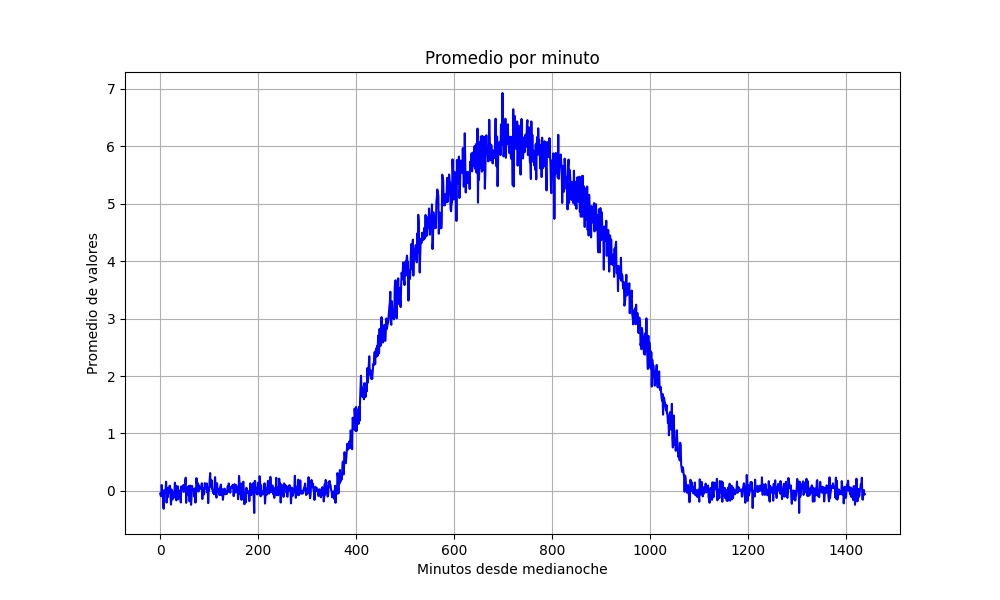

## Recopilacion de datos
Se modificó los archivos `task.py ` y `models.py` para añadir una una tabla en la base de datos creada en el anterior avance, para ello se mantuvo las columnas de `group`, `timestamp` y se añadio las columnas de `sunlight`, `value` y `minutes`. Las cuales `sunlight` y `value` son obtenidad directamente por medio de la API a la pagina web `kalouk.xyz` mientras que `minutes` es calculado respecto a `timestamp` y corresponde los minutos transcurridos desde las 0:00, y cada muestra de datos corresponde a 100 valores y se tomó una muestra cada un minuto por alderedor de 24 horas continuas, teniendo como resultado de alrededor de 144 000 datos. Con estos datos obtenidos se procedió a sacar el promedio de cada una de las muestras por minuto y se graficó en funcion de los minutos transcurridos desde media noche.

